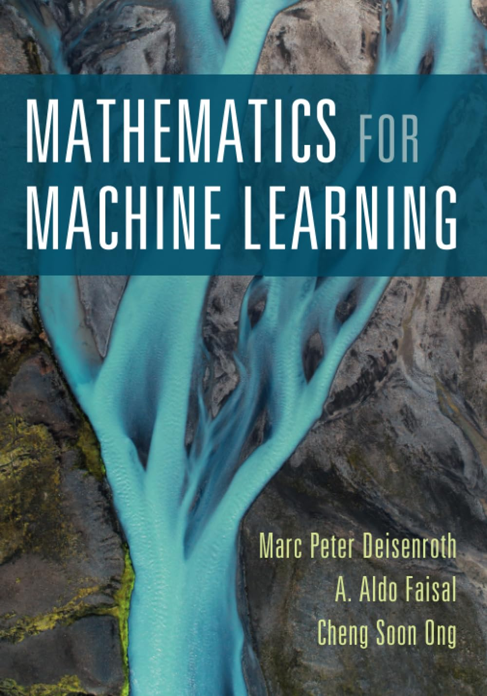

<p align="center">
  <br>
  <em>
    Com o crescente interesse em Inteligência Artificial, é fundamental que profissionais que desejam criar suas próprias LLMs tenham uma base sólida em matemática. No entanto, para evoluir rapidamente, é essencial focar no que realmente importa. Por isso, aplicarei a regra de Pareto (80/20) para aprender apenas os conceitos mais relevantes de Álgebra Linear, otimizando tempo e resultados.
  </em>
</p>

## Álgebra Linear - Ambiente de Desenvolvimento

> ❗ **Importante:** Este material foi desenvolvido exclusivamente para meu próprio aprendizado, com foco na implementação de LLMs especializadas em contextos específicos. Decidi compartilhar o conteúdo para que possa ser útil a outros interessados.

> 🧠 **Foco :** Desligue o celular, a televisão e procure um ambiente tranquilo. Busque manter o foco, mesmo que por alguns minutos, para aproveitar melhor o estudo.

> 💡 **Observação 3:** Caso não consiga executar localmente, é possível usar o [Google Colab](https://colab.research.google.com/).
 

### 1. Criar um ambiente virtual

No terminal, navegue até a pasta do projeto e execute:

```bash
python -m venv algebra_env
```

### 2. Ativar o ambiente virtual

**No Windows:**
```bash
algebra_env\Scripts\activate
```

**No Mac/Linux:**
```bash
source algebra_env/bin/activate
```

### 3. Instalar dependências e criar requirements.txt
Ainda dentro da pasta e no terminal, digite:
```bash
pip install notebook pandas numpy
```
Depois gere o arquivo *requirements.txt*
```bash
pip freeze > requirements.txt
```

### Como criei este conteúdo

Para facilitar a minha compreensão de um assunto tão denso, utilizei a seguinte abordagem para cada tópico:

- **Aplicações práticas gerais**
- **Exemplos de uso em LLMs**
- **Exemplos de código Python voltados para LLM**
- **Simbologia utilizada em Álgebra Linear referente ao tópico**

### Links Utéis

- [Master Machine Learning Faster: How to Apply the 80/20 Rule to Your Learning](https://dev.to/gervaisamoah/master-machine-learning-faster-how-to-apply-the-8020-rule-to-your-learning-4klm)
- [How Machine Learning Uses Linear Algebra to Solve Data Problems](https://www.freecodecamp.org/news/how-machine-learning-leverages-linear-algebra-to-optimize-model-trainingwhy-you-should-learn-the-fundamentals-of-linear-algebra/)
- [10 Powerful Applications of Linear Algebra in Data Science](https://www.analyticsvidhya.com/blog/2019/07/10-applications-linear-algebra-data-science/)
- [Video excelente sobre algebra linear](https://www.youtube.com/playlist?list=PLZHQObOWTQDPD3MizzM2xVFitgF8hE_ab)
